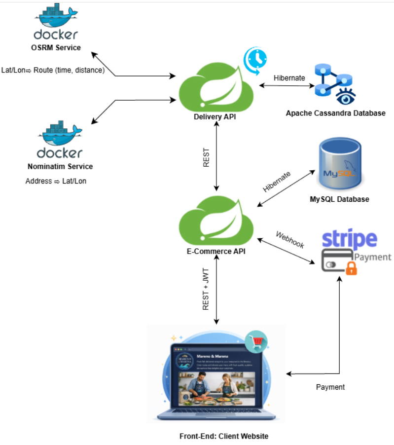
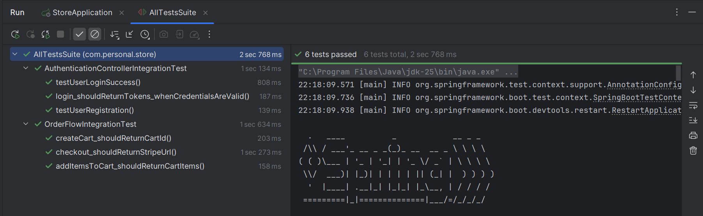

# Distributed E-Commerce Platform

Personal distributed e-commerce platform with a **Spring Boot REST API**, separate delivery service, and **React front-end**. Includes authentication (JWT), payments (Stripe), and MySQL database.

---

## System Design Architecture
Overview of the system architecture showing the components, data flow, and interactions within the application.

---

## Components

### 1. Front-End: Client Website
- **Description:** Web interface where customers browse products, place orders, and initiate payments. (React.js)
- **Interactions:** Sends REST + JWT requests to the E-Commerce API.

### 2. E-Commerce API
- **Description:** Backend API managing products, orders, and payments.  
- **Responsibilities:**  
  - Handles requests from the front-end.  
  - Initiates payments via Stripe and processes webhooks.  
  - Interacts with MySQL database for product and order data.

### 3. Stripe Payment
- **Description:** Third-party payment processor.  
- **Interactions:**  
  - Processes payments initiated from the front-end.  
  - Sends webhook notifications to the E-Commerce API upon success/failure.  
- [Stripe Documentation](https://docs.stripe.com/connect)

### 4. Delivery API
- **Description:** Manages delivery requests, routes, and status updates.  
- **Responsibilities:**  
  - Receives coordinates from Nominatim service.  
  - Calculates delivery routes using OSRM.  
  - Stores delivery data in Apache Cassandra.

### 5. Nominatim Service
- **Description:** Geocoding service converting addresses to latitude and longitude.  
- **Deployment:** Docker container.  
- **Interactions:** Provides coordinates to the Delivery API.  
- [Nominatim Docs](https://nominatim.org/release-docs/latest/admin/Installation/)

### 6. OSRM Service
- **Description:** Routing engine calculating delivery routes.  
- **Deployment:** Docker container.  
- **Interactions:** Provides route distance and estimated delivery time to the Delivery API.  
- [OSRM API Docs](https://project-osrm.org/docs/v5.24.0/api/#)

### 7. Databases
- **MySQL Database:** Stores product info, customer info, and orders. Accessed by E-Commerce API via Hibernate. Migration files managed with Flyway.  
  - [MySQL Documentation](https://dev.mysql.com/doc/)
- **Apache Cassandra Database:** Stores delivery-related data. Accessed by Delivery API via Hibernate. CQL script run on Docker to generate databases.  
  - [Cassandra Documentation](https://cassandra.apache.org/doc/latest/cassandra/installing/installing.html)

---

## Website Flow

A quick overview of the user journey through the website: from landing to order completion.

### 0. Start Page
Landing page where users can explore the platform or navigate to login.

### 1. Login
Secure login page to access the user account.

### 2. Order Page
Browse products, select items, and add to cart.

### 3. Checkout Page
Review order summary and confirm items.

### 4. Stripe Payment Page
Secure payment processing via Stripe.

### 5. Order Verification Page
Confirmation page showing successful order and order details.

### 6. Order History & Delivery Info
View past orders, track deliveries, and see detailed order information.

---

## Tests
Code includes tests for authentication and order flow.

---

## Technologies Used
- **Frontend:** React.js  
- **Backend:** Java, Spring Boot, Hibernate  
- **Databases:** MySQL, Apache Cassandra  
- **Deployment & Services:** Docker, Nominatim, OSRM  
- **Authentication & Payments:** JWT, Stripe  
- **Testing:** Spring Boot testing framework

---

## License
This project is open source and available under the [MIT License](LICENSE).
